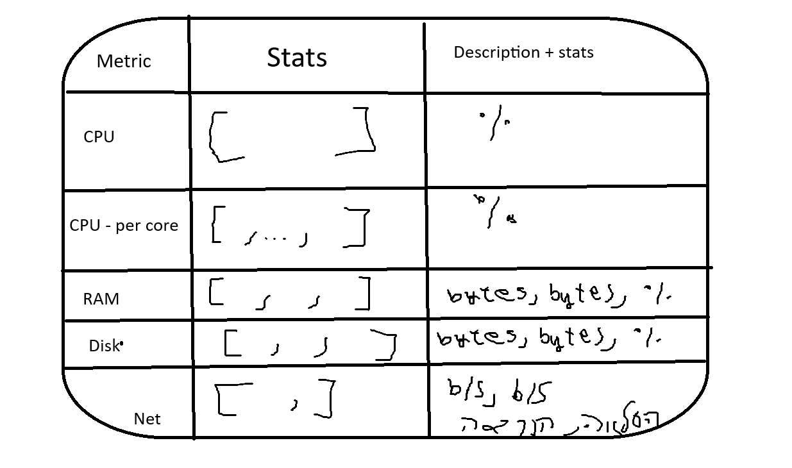

# Sysmon - Design Document

This project goal is to display in real time, the usage of hardware components in the system.

## Architecture Overview:
main.py - Entry point and CLI parser. Initializer of the subsystems.

### Subsytems:
 * Collector - Live data gathering through system APIs.
   * Each function will be assigned to a thread, so it could calculate the statistics on the same interval.

 * Logger - Appending incoming data from the 'Collector' to the log file, at shutdown appends current data. JSON format.
   * Logs are buffered into a queue-like list, then on independent thread are appended to the log file. Errors have
   * their own json description.
 * Display - Live rendered data, that was collected from the 'Collector'.

## Table Vision

## Graceful Shutdown

 * Used signaling + threading's events techniques.

